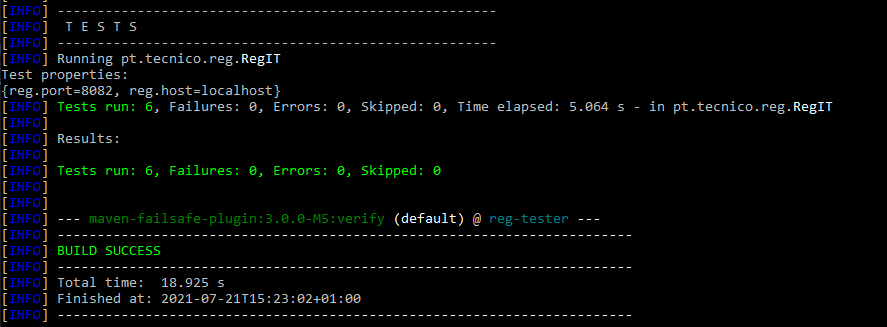

# ist186286-RegCor

Distributed Systems, special project

## Author

**ist186286**

862686 [Cláudia Ramires](mailto:claudiaramires@tecnico.ulisboa.pt)


## Getting Started

The overall system is composed of multiple modules.

See the [project statement](https://github.com/tecnico-distsys/RegCor-EE) for a full description of the domain and the system.

### Pre - requisites

Java Developer Kit 11 is required running on Linux, Windows or Mac.
Maven 3 is also required.

To confirm that you have them installed, open a terminal and type:

```
javac -version

mvn -version
```

### Installing

#### Installing - First Step

* To compile and install all modules (execute this command before executing all others):

```
mvn clean install -DskipTests
```

The integration tests are skipped because they require the servers to be running.


#### Connecting to Zookeeper 

* To run Zookeper (assuming that you are in the current directory):

**linux**
```shell
cd /path/zookeeper/bin
./zkServer.sh start
```

**windows**
```shell
cd \path\zookeeper\bin
zkServer.cmd
```

### Running RegCor

####  Running Server

* To start the server (assuming that you are in the current directory):

```
cd reg
mvn clean compile exec:java
```

* To start the multiple servers in a specific ports open the terminal (all in the current directory): 

```
cd reg
mvn clean compile exec:java -D instance=N
```

assuming N is the number you want the server to be hosted

#### Running Tests

* To run the integration tests (assuming that you are in the rec-tester directory and the server is already running):

```
cd rec-tester
mvn verify
```




#### Running Client

* To run the client  (assuming that you are in the current directory):

```
cd rec-tester
mvn compile exec:java
```


## Built With

* [Maven](https://maven.apache.org/) - Build Tool and Dependency Management
* [gRPC](https://grpc.io/) - RPC framework


## Versioning

We use [SemVer](http://semver.org/) for versioning.
